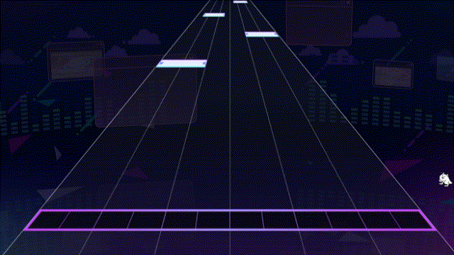

# Mixed

Tap/Flick Ladder

<figure><figcaption></figcaption></figure>

As seen in Lower's Master.

Hold + Flick -> Tap

YEAH THE NAME'S BAD I KNOW

As seen in Intense Voice Expert.

<figure><figcaption></figcaption></figure>

Double Hold Into Flick Buildup

As seen in Intense Voice Expert.

<figure><figcaption></figcaption></figure>

Double L/R Flick Ladder

As seen in Intense Voice Expert.

<figure><figcaption></figcaption></figure>

Taps Into Flick

Intense Voice Expert.

<figure><figcaption></figcaption></figure>

Drumroll

Added by ProtoCat

<figure><figcaption></figcaption></figure>

## Streams



<figure><figcaption></figcaption></figure>

Example of a simple spam.

Intense Voice Expert.



Added by Protocat

<figure><figcaption></figcaption></figure>



<figure><figcaption></figcaption></figure>

Intense Voice Expert.



Added by ProtoCat

<figure><figcaption></figcaption></figure>



Added by ProtoCat

<figure><figcaption></figcaption></figure>


