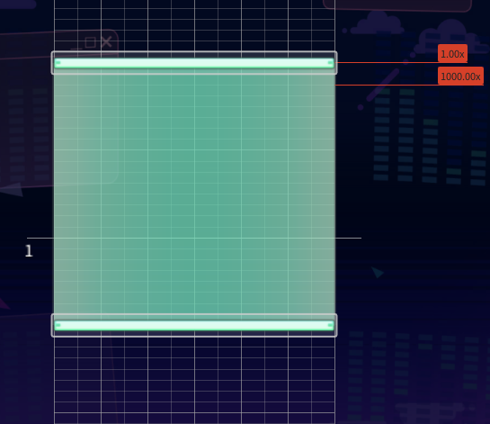

# Hold

⭐Dissapearing Hold

Added by @.caling

<figure><figcaption></figcaption></figure>

<figure><figcaption></figcaption></figure>

Overlapping Holds

<figure><figcaption></figcaption></figure>

Added by @.caling

Left/Right Cut

As seen in shojo rei's master

<figure><figcaption></figcaption></figure>

Wavy Hold into Critical Transition

<figure><figcaption></figcaption></figure>

added by  @soraliee.\_ / minn

Hold Stack

Video by @znox\_x
\

<figure><figcaption></figcaption></figure>

