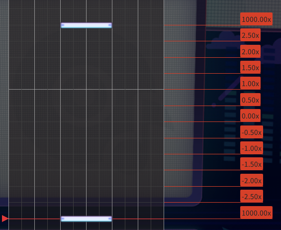

# Mixed / Special

Trace guide MISC1

<figure><figcaption></figcaption></figure>

Video by @obvredwolf

Trace/Tap Back &#x26; Forth

<figure><figcaption></figcaption></figure>

Video by @obvredwolf

Instant Movement

Added by ProtoCat

<figure><figcaption></figcaption></figure>

<figure><figcaption></figcaption></figure>

Note bounce

<figure><figcaption></figcaption></figure>

<figure><figcaption></figcaption></figure>

Added by c0d3r_
 Note: the 1000x speed at the end is only needed if the note is going to bounce again, otherwise setting to 1x speed is best.
 Use multiple layers to allow for notes to bouce without interfering with the rest of the chart.

