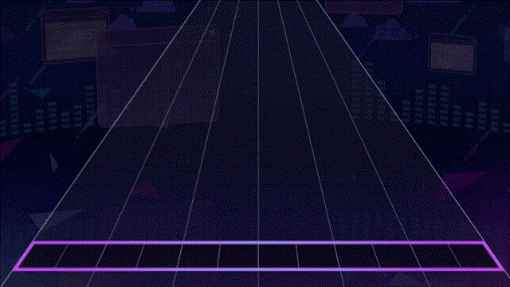
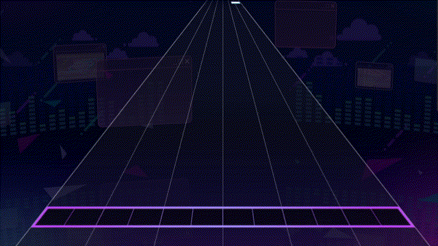

# Streams

A stream is a series of related tiles. e.g. (Intense Voice Expert). They're usually in alternating fashion, but they don't have to be.

<figure><figcaption></figcaption></figure>



Added by ProtoCat

<figure><figcaption></figcaption></figure>



## Spams



<figure><figcaption></figcaption></figure>

Example of a simple spam.

Intense Voice Expert.



Added by Protocat

<figure><figcaption></figcaption></figure>


