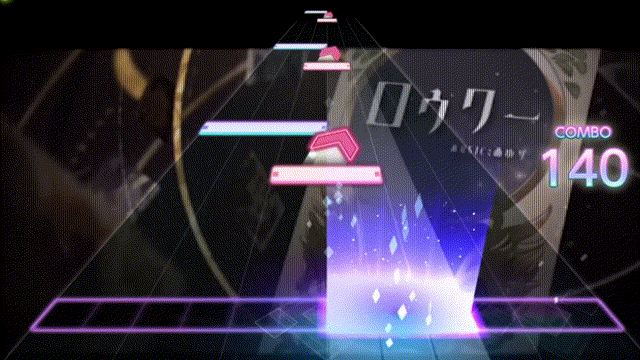

# Streams

A stream is a series of related tiles. e.g. (Intense Voice Expert). They're usually in alternating fashion, but they don't have to be.

⭐Examples

<figure><figcaption></figcaption></figure>

<figure><figcaption></figcaption></figure>

<figure><figcaption></figcaption></figure>

## Spams



Added by Protocat

<figure><figcaption></figcaption></figure>



Added by ProtoCat

<figure><figcaption></figcaption></figure>


