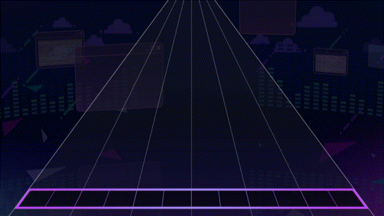
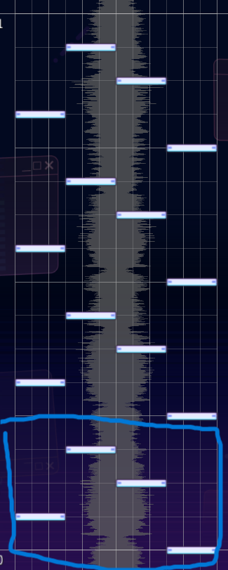
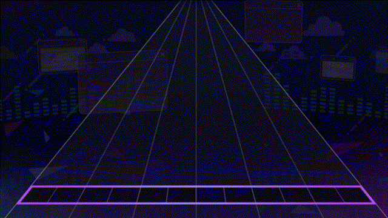
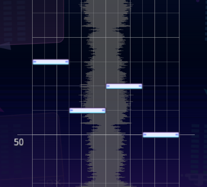

# Streams

A stream is a pattern where you alternate between two notes at a fixed timing interval, usually for a prolonged period at 8ths or 16th notes. e.g. (Intense Voice Expert). They're usually in alternating fashion, but they don't have to be.

⭐Examples

<figure><figcaption></figcaption></figure>

<figure><figcaption></figcaption></figure>

## Spams



Added by Protocat

<figure><figcaption></figcaption></figure>



Added by ProtoCat

<figure><figcaption></figcaption></figure>



Added by Protocat

<figure><figcaption></figcaption></figure>

<figure><figcaption></figcaption></figure>



Added by Protocat

<figure><figcaption></figcaption></figure>

<figure><figcaption></figcaption></figure>



