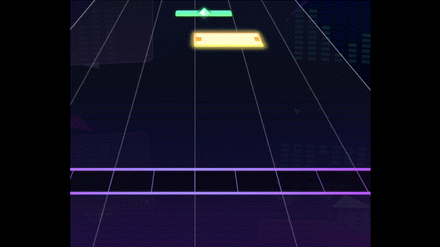

# Info

Traces are very unique as in they can be used in basically every scenario.

e.g:

As Decoration

As seen in: Marble Blue Master

Trace background is used to make the hold golden.

<figure><figcaption></figcaption></figure>

As a flick

While not actually considered a flick, it can be hit in the same way.

<figure><figcaption></figcaption></figure>

